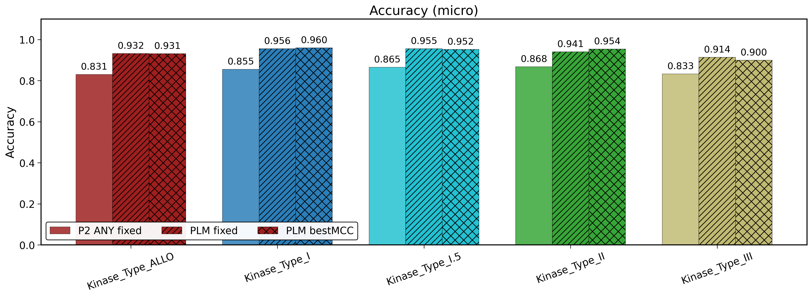
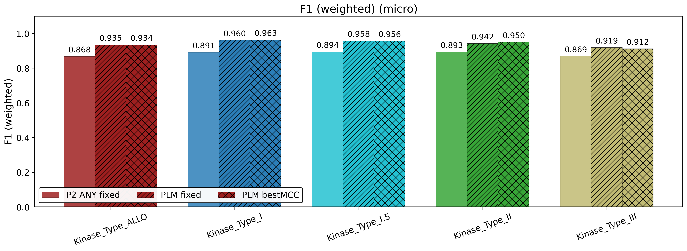
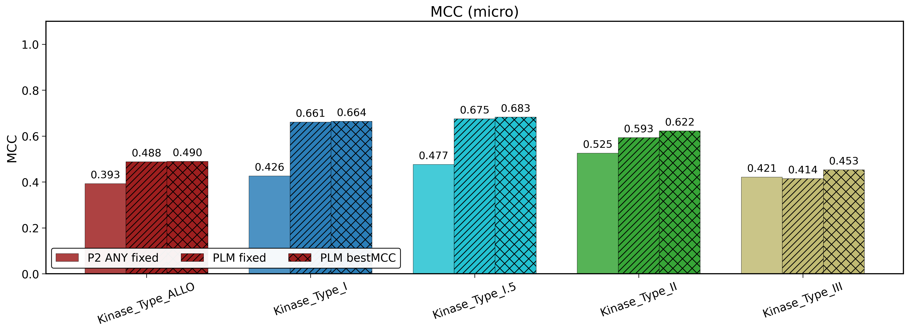
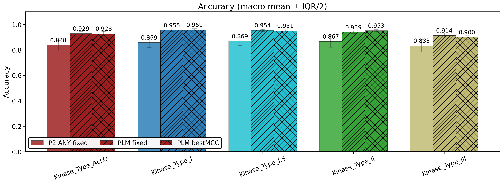
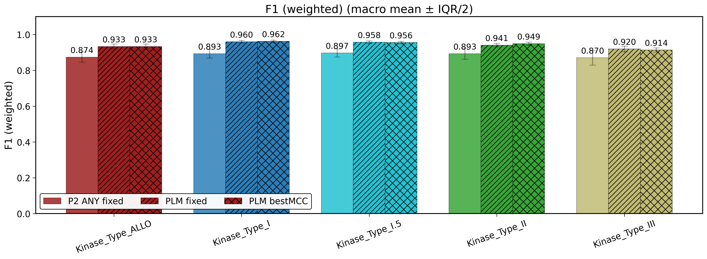
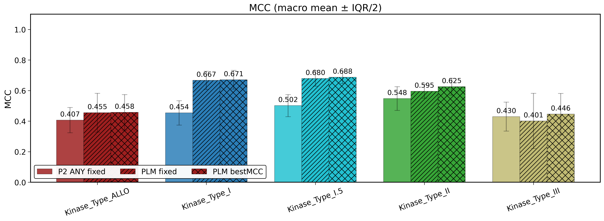
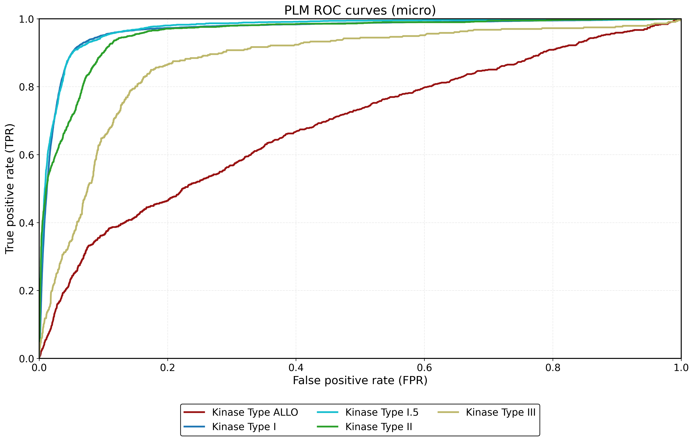
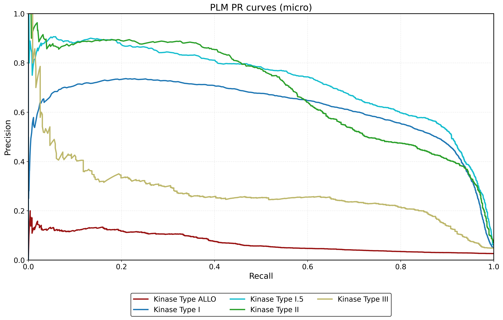

# Combined report

_Generated: 2026-01-08T20:23:51.855974+00:00Z_

## Micro bars (from eval JSON)







## Macro bars (mean ± IQR/2, from eval JSON)







## PLM ROC curves (micro) — from raw scores



## PLM PR curves (micro) — from raw scores



## AUROC (from raw scores)

| dataset          |   auroc_from_scores |
|:-----------------|--------------------:|
| Kinase_Type_ALLO |            0.68599  |
| Kinase_Type_I    |            0.96649  |
| Kinase_Type_I.5  |            0.971667 |
| Kinase_Type_II   |            0.955231 |
| Kinase_Type_III  |            0.871374 |

## AUPR (from raw scores)

| dataset          |   aupr_from_scores |
|:-----------------|-------------------:|
| Kinase_Type_ALLO |          0.0721546 |
| Kinase_Type_I    |          0.619043  |
| Kinase_Type_I.5  |          0.726287  |
| Kinase_Type_II   |          0.688647  |
| Kinase_Type_III  |          0.275881  |

## Notes

```
[Kinase_Type_ALLO] P2 ANY fixed: weighted F1 not found -> using 'f1' (fallback).
[Kinase_Type_I] P2 ANY fixed: weighted F1 not found -> using 'f1' (fallback).
[Kinase_Type_I.5] P2 ANY fixed: weighted F1 not found -> using 'f1' (fallback).
[Kinase_Type_II] P2 ANY fixed: weighted F1 not found -> using 'f1' (fallback).
[Kinase_Type_III] P2 ANY fixed: weighted F1 not found -> using 'f1' (fallback).
[Kinase_Type_ALLO] PLM fixed: weighted F1 not found -> using 'f1' (fallback).
[Kinase_Type_I] PLM fixed: weighted F1 not found -> using 'f1' (fallback).
[Kinase_Type_I.5] PLM fixed: weighted F1 not found -> using 'f1' (fallback).
[Kinase_Type_II] PLM fixed: weighted F1 not found -> using 'f1' (fallback).
[Kinase_Type_III] PLM fixed: weighted F1 not found -> using 'f1' (fallback).
[Kinase_Type_ALLO] PLM bestMCC: weighted F1 not found -> using 'f1' (fallback).
[Kinase_Type_I] PLM bestMCC: weighted F1 not found -> using 'f1' (fallback).
[Kinase_Type_I.5] PLM bestMCC: weighted F1 not found -> using 'f1' (fallback).
[Kinase_Type_II] PLM bestMCC: weighted F1 not found -> using 'f1' (fallback).
[Kinase_Type_III] PLM bestMCC: weighted F1 not found -> using 'f1' (fallback).
[Kinase_Type_ALLO] P2 ANY fixed: weighted F1 (macro) not found -> using 'f1' (fallback).
[Kinase_Type_I] P2 ANY fixed: weighted F1 (macro) not found -> using 'f1' (fallback).
[Kinase_Type_I.5] P2 ANY fixed: weighted F1 (macro) not found -> using 'f1' (fallback).
[Kinase_Type_II] P2 ANY fixed: weighted F1 (macro) not found -> using 'f1' (fallback).
[Kinase_Type_III] P2 ANY fixed: weighted F1 (macro) not found -> using 'f1' (fallback).
[Kinase_Type_ALLO] PLM fixed: weighted F1 (macro) not found -> using 'f1' (fallback).
[Kinase_Type_I] PLM fixed: weighted F1 (macro) not found -> using 'f1' (fallback).
[Kinase_Type_I.5] PLM fixed: weighted F1 (macro) not found -> using 'f1' (fallback).
[Kinase_Type_II] PLM fixed: weighted F1 (macro) not found -> using 'f1' (fallback).
[Kinase_Type_III] PLM fixed: weighted F1 (macro) not found -> using 'f1' (fallback).
[Kinase_Type_ALLO] PLM bestMCC: weighted F1 (macro) not found -> using 'f1' (fallback).
[Kinase_Type_I] PLM bestMCC: weighted F1 (macro) not found -> using 'f1' (fallback).
[Kinase_Type_I.5] PLM bestMCC: weighted F1 (macro) not found -> using 'f1' (fallback).
[Kinase_Type_II] PLM bestMCC: weighted F1 (macro) not found -> using 'f1' (fallback).
[Kinase_Type_III] PLM bestMCC: weighted F1 (macro) not found -> using 'f1' (fallback).
```